# PaceTown Vision — Mermaid Diagram Suite

This diagram suite visualizes the complete vision defined in `PACETOWN_PROJECT_VISION.md` and the implementation behavior specified in `PaceTown_Hackathon_Implementation_Plan.md`.

The vision is split into focused diagrams so each flow remains readable and renderable. Together, they describe the track alignment, player experience, workload logic, guided work, recovery system, IRL quests, photo-derived Keepsakes, town mechanics, progression, safeguards, and technical architecture.

## 1. Track problem to PaceTown outcome

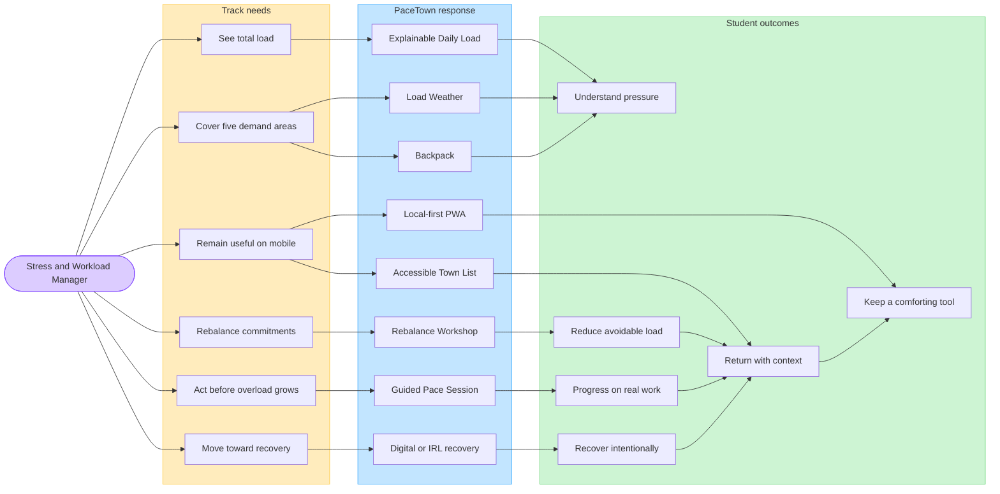

## 2. Complete player experience loop

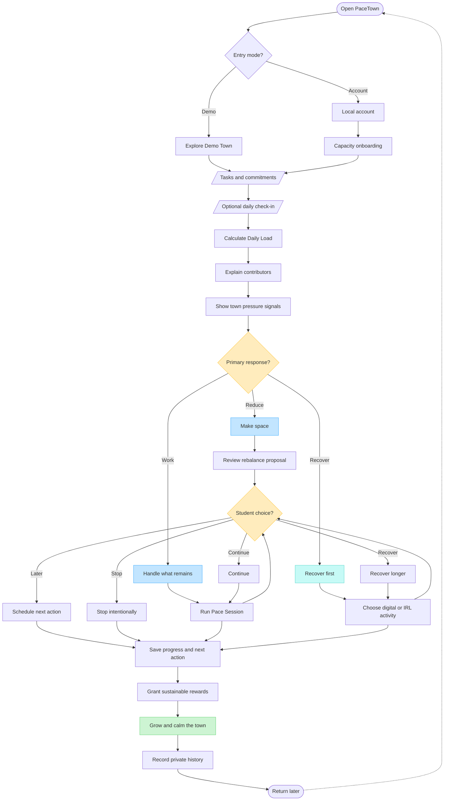

## 3. Workload understanding and primary-response selection

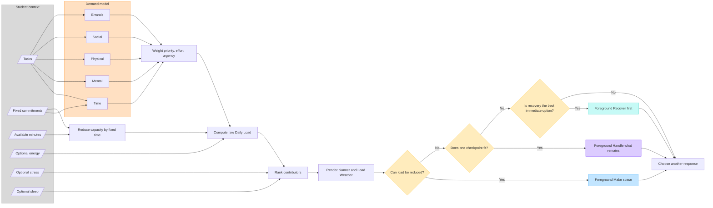

## 4. Consent-based rebalancing

```mermaid
flowchart LR
    overloaded([Overloaded day])
    findMovable["Find flexible work"]
    protectFixed["Lock fixed commitments"]
    checkDeadline{Before deadline?}
    checkSpace{Valid time block?}
    checkMinimum{Useful session length?}
    testMove["Test alternative slot"]
    compare["Compare peak load"]
    better{Improves balance?}
    proposal["Build editable proposal"]
    preview["Show before and after"]
    studentChoice{Student decision?}
    acceptAll["Accept all"]
    acceptSome["Accept selected"]
    editMove["Edit proposal"]
    rejectMove["Reject proposal"]
    applyMove["Apply approved changes"]
    updatePlanner["Update planner"]
    updateSession["Update Pace Session suggestion"]
    updateTown["Lighten Backpack and weather"]
    unchanged["Keep current schedule"]

    overloaded --> findMovable
    overloaded --> protectFixed
    findMovable --> checkDeadline
    protectFixed --> proposal
    checkDeadline -->|"Yes"| checkSpace
    checkDeadline -->|"No"| findMovable
    checkSpace -->|"Yes"| checkMinimum
    checkSpace -->|"No"| findMovable
    checkMinimum -->|"Yes"| testMove
    checkMinimum -->|"No"| findMovable
    testMove --> compare
    compare --> better
    better -->|"Yes"| proposal
    better -->|"No"| findMovable
    proposal --> preview
    preview --> studentChoice
    studentChoice -->|"All"| acceptAll
    studentChoice -->|"Some"| acceptSome
    studentChoice -->|"Edit"| editMove
    studentChoice -->|"Reject"| rejectMove
    editMove --> proposal
    acceptAll --> applyMove
    acceptSome --> applyMove
    applyMove --> updatePlanner
    updatePlanner --> updateSession
    updateSession --> updateTown
    rejectMove --> unchanged

    style protectFixed fill:#D9D9D9,stroke:#B3B3B3
    style studentChoice fill:#FFECBD,stroke:#FFC943
    style applyMove fill:#CDF4D3,stroke:#66D575
    style rejectMove fill:#FFCDC2,stroke:#FF7556
```

## 5. Guided Pace Session lifecycle

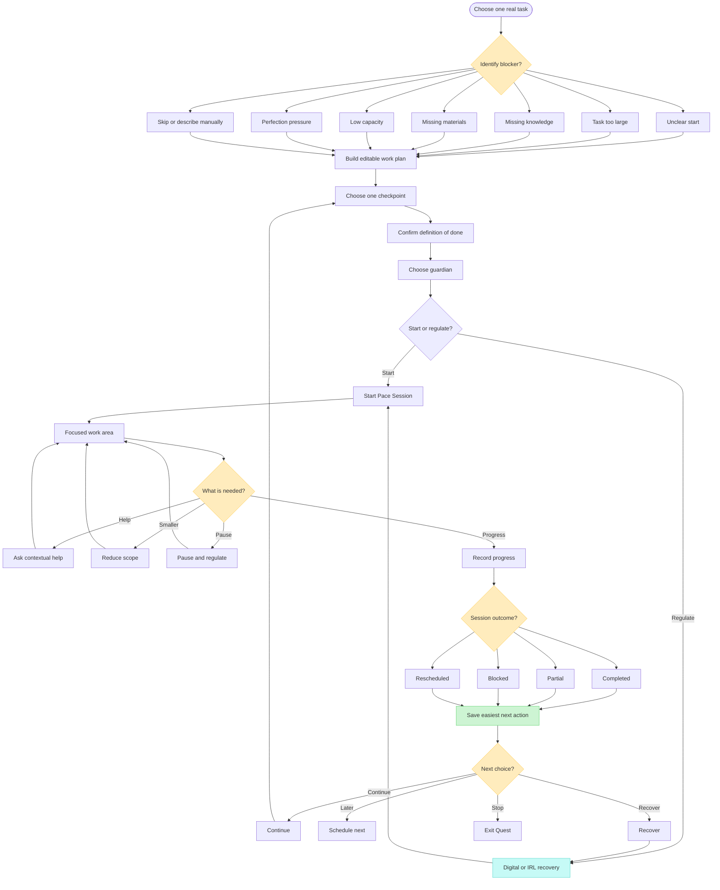

## 6. Guardian assistance routing

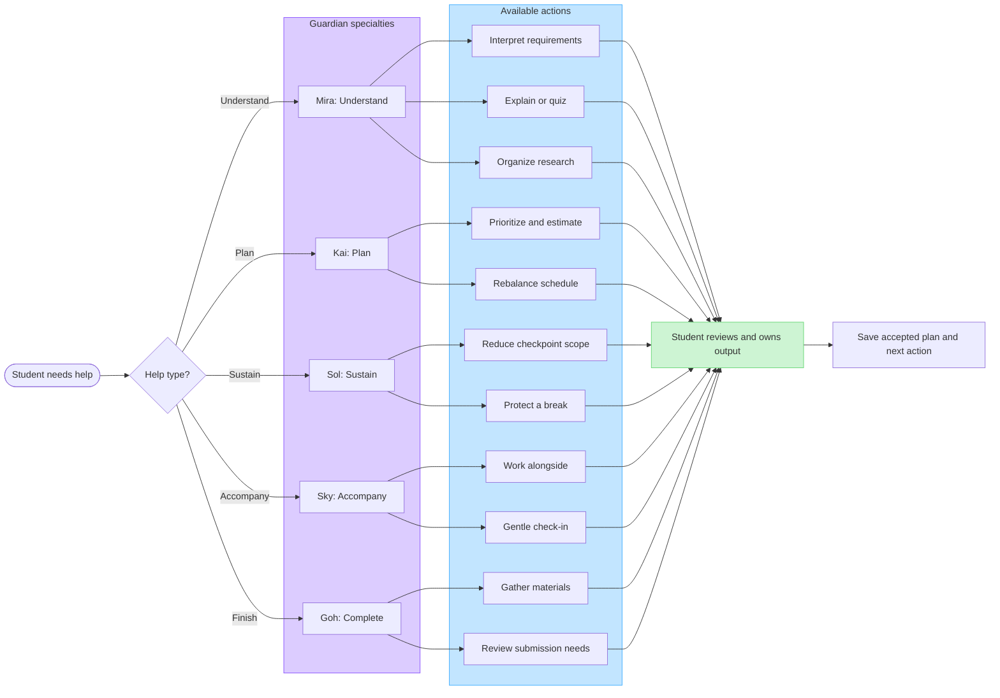

## 7. Recovery activity choice

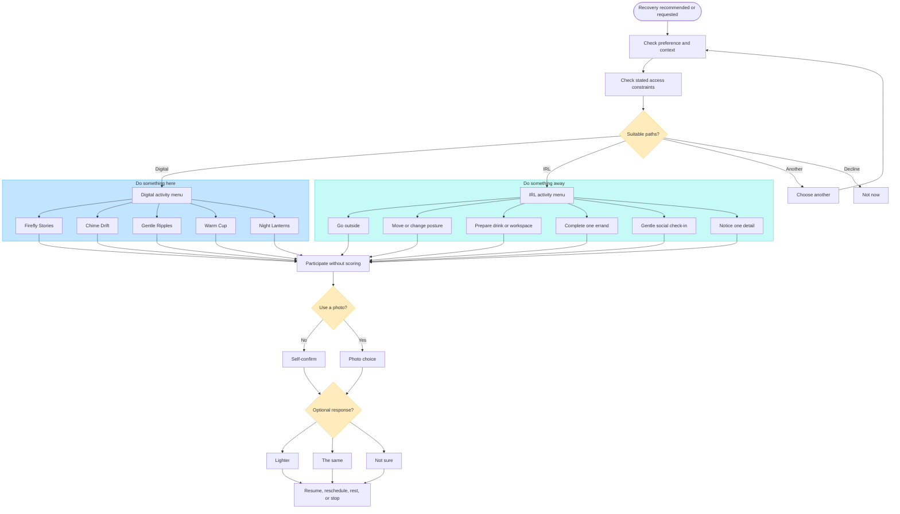

## 8. Digital mini-game behavior

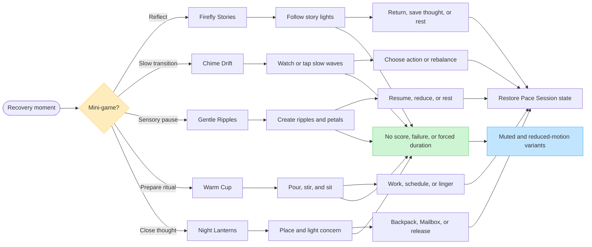

## 9. Detailed IRL quest catalogue

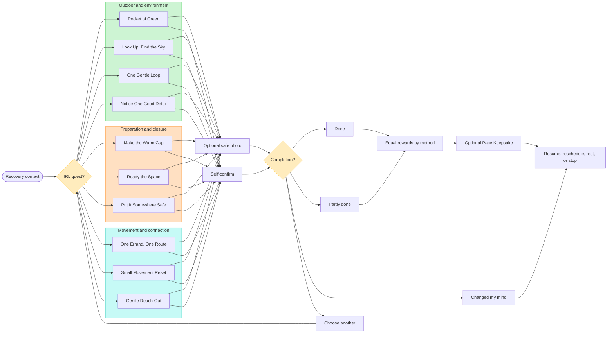

## 10. Photo verification and Pace Keepsake pipeline

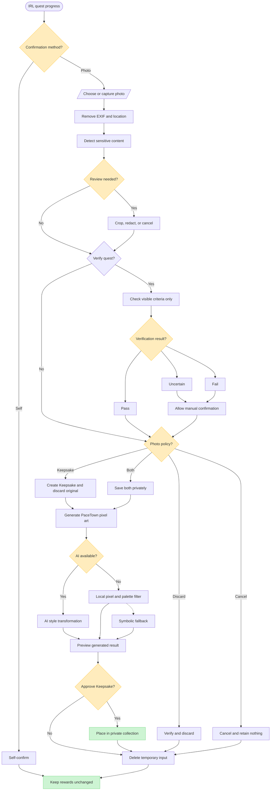

## 11. Keepsake collection and placement

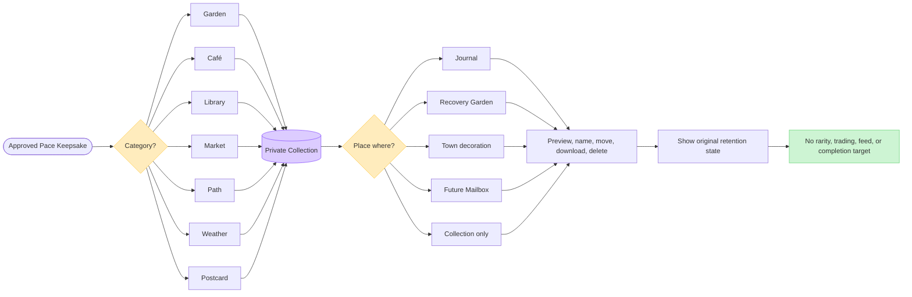

## 12. Town locations and mechanics

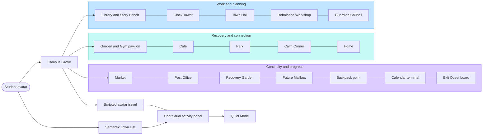

## 13. Game progression without punishment

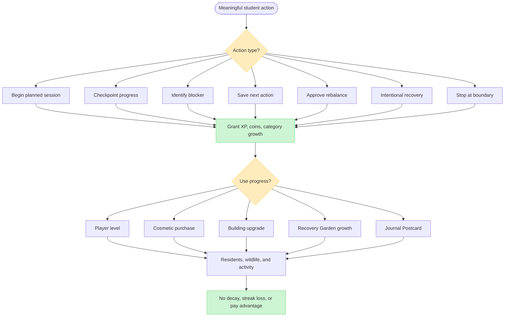

## 14. Accessibility, privacy, and safety gates

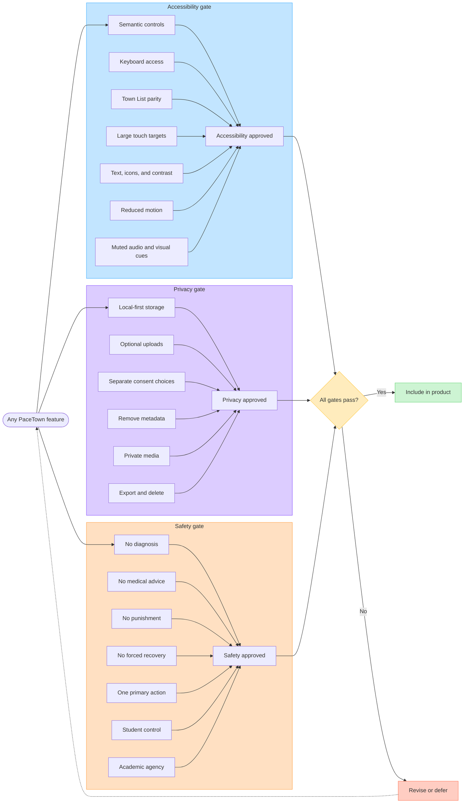

## 15. Local-first product architecture

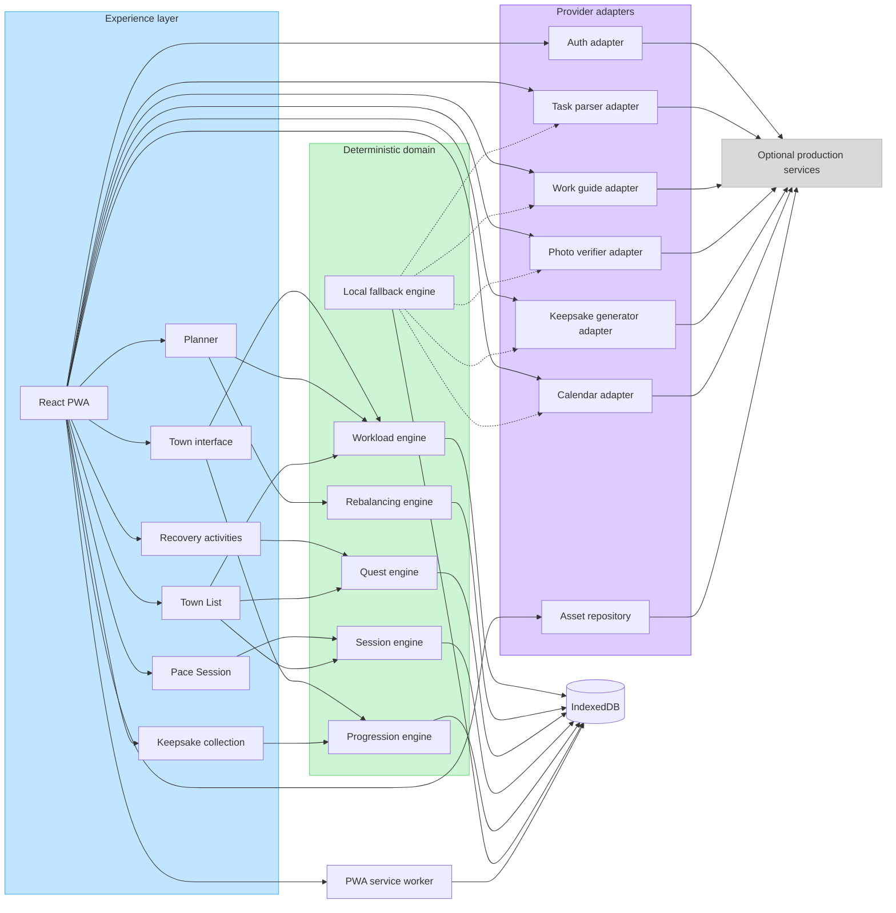

## 16. Hackathon vertical slice

```mermaid
flowchart LR
    seed([Aina demo starts])
    fiveAreas["Show five demand areas"]
    load108["Explain Thursday at 108 percent"]
    townPressure["Render district pressure"]
    backpack["Show weighted Backpack"]
    moveForm["Move flexible admin form"]
    lockFixed["Keep fixed commitments locked"]
    lowerLoad["Lower Thursday load"]
    selectAssignment["Choose database assignment"]
    blocker["Select unclear start"]
    brief["Review seeded brief"]
    checkpoint["Choose entity checkpoint"]
    miraHelp["Ask Mira one question"]
    partial["Record partial ERD progress"]
    saveNext["Save junction entity action"]
    ripples["Use Gentle Ripples"]
    pocketGreen["Choose Pocket of Green"]
    showAlternatives["Show outdoor and indoor paths"]
    photoChoice["Use seeded optional photo"]
    sanitize["Remove metadata and review"]
    generate["Generate Garden Keepsake"]
    approve["Approve private placement"]
    townGrowth["Clear Library and grow plant"]
    journal["Show complete private history"]
    proof([Track problem answered])

    seed --> fiveAreas
    fiveAreas --> load108
    load108 --> townPressure
    townPressure --> backpack
    backpack --> moveForm
    moveForm --> lockFixed
    lockFixed --> lowerLoad
    lowerLoad --> selectAssignment
    selectAssignment --> blocker
    blocker --> brief
    brief --> checkpoint
    checkpoint --> miraHelp
    miraHelp --> partial
    partial --> saveNext
    saveNext --> ripples
    ripples --> pocketGreen
    pocketGreen --> showAlternatives
    showAlternatives --> photoChoice
    photoChoice --> sanitize
    sanitize --> generate
    generate --> approve
    approve --> townGrowth
    townGrowth --> journal
    journal --> proof

    style fiveAreas fill:#FFE0C2,stroke:#FF9E42
    style lowerLoad fill:#CDF4D3,stroke:#66D575
    style partial fill:#C2E5FF,stroke:#3DADFF
    style ripples fill:#C6FAF6,stroke:#5AD8CC
    style pocketGreen fill:#C6FAF6,stroke:#5AD8CC
    style generate fill:#DCCCFF,stroke:#874FFF
    style proof fill:#CDF4D3,stroke:#66D575
```

## 17. Delivery priorities and expansion path

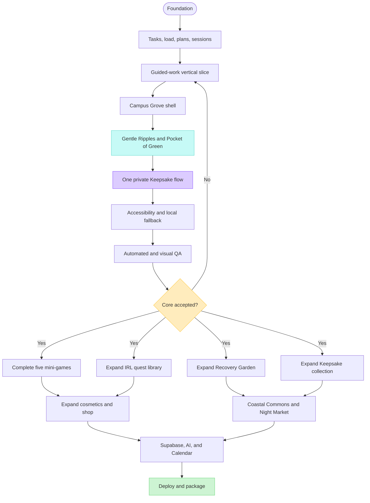
