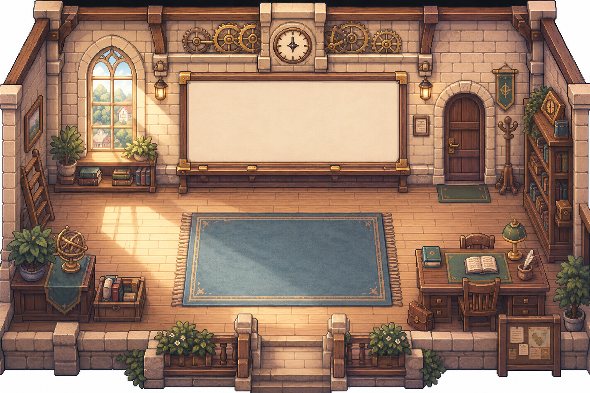
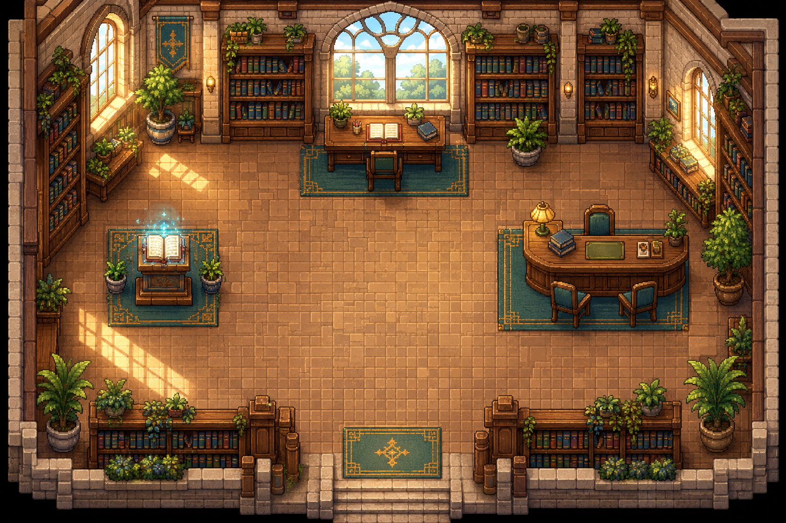

# PaceTown


PaceTown is a local-first pixel-art guided-work and recovery game for
university students. It turns a real week into an understandable workload,
helps move what can safely move, makes one remaining task startable, and keeps
recovery and context available without shame, streaks, or diagnosis.

## Product Loop

```text
Understand the week
    -> move what can safely move
    -> choose one real task
    -> make one checkpoint
    -> work with a guardian
    -> recover intentionally
    -> return with the next action intact
```

The system is not a generic wellbeing dashboard or an AI homework assistant.
Its calculations are deterministic and local. Guardians provide contextual
support, but the student reviews and owns every plan, checkpoint, note, and
outcome.

## Design Principles

These rules come from the product vision and constrain every feature:

- **No shame, ever.** Pressure changes atmosphere and activity; the town is
  never damaged, frightening, or degraded. There are no streaks, no missed-day
  messaging, no overdue shame, and no health scores or diagnoses.
- **Every number is explainable.** Daily Load, bands, weights, and rebalance
  previews show their arithmetic. A chart may explain pressure, but the town
  must always help the student respond to it.
- **Consent before change.** Rebalance proposals are previews until explicitly
  approved. Keepsakes are placed only after preview approval. Deletion choices
  are explicit.
- **Rest is legitimate work.** Pausing, partial progress, realistic
  rescheduling, and healthy stopping are valid, rewarded outcomes. Recovery
  needs no prerequisites and is never gated behind productivity.
- **Growth never decays.** Progress, help-seeking, and sustainable choices
  accumulate; absence removes nothing.
- **Privacy by construction.** Photos are optional and checked only with local
  heuristics; keepsakes never prove a quest happened; photo users gain no
  advantage.

## Current Status

The repository contains a functional browser prototype of the Campus Grove
vertical slice. It runs without a cloud service, AI provider, or Google
Calendar connection.

Implemented:

- Live landing page with the seeded week and real domain calculations
- Local account, guest-demo, sign-in, and four-step onboarding paths
- Town Hall natural-language intake with visible assumptions and editable commitments
- Daily Load calculation with fixed/flexible work, weighted demand, bands, and Load Weather
- Clock Tower room with a seven-day Week Board
- Kai's consent-first rebalance preview, destination comparison, drag-and-drop planning, deadline guards, and undo
- Library room with Mira's open-work list, day navigation, task paging, blocker guidance, and one-checkpoint proposals
- Pace Sessions with done definitions, timers, scratchpad, free-text contextual help, outcomes, and progress continuity
- Welcome-back desk panel, open-work resume badge, and HUD resume ritual
- Gentle Ripples, Pocket of Green, Firefly Stories, Chime Drift, Warm Cup, and Night Lanterns
- Photo-safe Pocket verification with self-confirmation and manual fallback
- Private Keepsakes with local pixel filtering or symbolic fallback
- Journal, Future Mailbox, Backpack, Guardian Council, Recovery Garden, Settings, Shop, Quiet Mode, and High Contrast
- Versioned local saves, JSON export, `/reset` demo reset, and production-only offline shell registration
- **319 tests across 35 files**, with typecheck and production build passing

## Guardian System

PaceTown uses five recurring guardians as functional product guides. Each one
owns a different type of decision in the student journey: understanding work,
planning time, sustaining capacity, accompanying focused work, or finishing
loose ends. Guardians do not act as mascots, productivity judges, or clinical
advisors. They provide contextual suggestions while the student remains in
control of every plan and action.

| Guardian | Location | Product role | Primary responsibilities |
| --- | --- | --- | --- |
|  | Library | **Mira — Understand** | Interprets assignment briefs, organizes requirements, explains difficult concepts, and turns an unclear task into one checkpoint with a visible definition of done. |
|  | Clock Tower | **Kai — Plan** | Makes schedule pressure understandable, estimates realistic capacity, identifies flexible work, previews safe calendar moves, and requires approval before anything is rearranged. |
|  | Garden and Park | **Sol — Sustain** | Helps the student reduce scope, choose a smaller action, protect breaks, and use recovery activities without treating rest as failure or measuring health. |
|  | Café | **Sky — Accompany** | Provides quiet body-doubling-style presence, gentle check-ins, and low-pressure encouragement for students who benefit from company while working. |
|  | Market | **Goh — Complete** | Organizes missing materials, groups errands, tracks final requirements, and helps close small outstanding details without creating additional urgency. |

### How Guardians Participate

- **Before work:** the selected blocker routes the student to a relevant guardian; the student can override that default when another style of support is more useful.
- **During work:** the active guardian remains available through contextual help modes such as Plan, Explain, Brainstorm, Review, Debug, and What next?
- **When the student is stuck:** guardian actions perform concrete, reversible support — for example, splitting a checkpoint, shrinking its scope, drafting an outline into the scratchpad, starting a shared timer, or adding a gathering checklist.
- **When the student returns:** the active guardian summarizes the task, checkpoint, time spent, saved progress, and next action without missed-day messaging, streaks, or guilt.
- **When pressures compete:** the Guardian Council combines the relevant specialties into one foreground recommendation while preserving alternative choices.

Guardian guidance is local, deterministic, and editable. It distinguishes
suggestions from the student's own work, never claims that generated text
satisfies an academic requirement, and never provides a diagnosis or health
assessment.

### Blocker Routing

When a student says what is actually in the way, the plan follows the
blocker to the guardian whose specialty matches it (implementation plan §9).
The student may keep the routed guardian or switch to any other:

| What Is in the Way | First Response | Guardian Action |
| --- | --- | --- |
| I do not know where to begin | Identify the smallest observable first action | Mira extracts requirements or creates an outline |
| The task is too large | Reduce the checkpoint until it fits the time available | Kai splits or reschedules the remaining work |
| I do not understand something | Identify the exact concept or question | Mira explains, quizzes, or builds a learning path |
| I am missing materials | Produce a short gathering checklist | Goh gathers requirements and tracks missing items |
| I have low capacity today | Offer a shorter session, low-effort action, or recovery first | Sol protects a break and reduces pressure |
| I am worried it will not be good enough | Define a deliberately rough first version | Sky starts a low-pressure body-doubling session |
| Something else | Let the student describe it, or plan manually | No interpretation is imposed |

## Routes

| Route | Purpose |
| --- | --- |
| `/` | Landing page and live town introduction |
| `/signup` | Local browser-only account creation and guest demo entry |
| `/login` | Local sign-in and simulated Google profile flow |
| `/welcome` | Skippable four-step onboarding |
| `/town` | Authenticated Campus Grove experience |
| `/game` | Presenter front door; creates a guest session and opens the seeded town |
| `/demo` | Narrow legacy mentor demo with Sky and breathing |
| `/reset` | Developer/presenter shortcut; clears the game save and session, then opens `/game` |

The app stores accounts, sessions, and game progress in the browser. This is
intentional prototype behavior, not production authentication.

## Run Locally

### Requirements

- Node.js 24 or newer
- npm 10 or newer

### Setup

```powershell
git clone https://github.com/CSL06/PaceTown.git
cd PaceTown
npm install
npm run dev
```

Open the URL printed by Vite. The usual development address is
`http://localhost:5173/`.

### Useful Commands

```powershell
npm test             # run the full Vitest suite
npm run test:watch   # run Vitest interactively
npm run build        # typecheck and build production assets
npm run preview      # serve the production build locally
```

For a clean presenter run, open:

```text
http://localhost:5173/reset
```

It clears the local game save and active session, then redirects to the
one-click `/game` demo path. Home and Settings also provide careful reset/data
controls.

## Current Demo Flow

The canonical presenter script is [`prototypeflow.md`](prototypeflow.md). The
short version is:

1. Open `/reset`, then `/game`.
2. Enter Campus Grove. A first-run Kai intro leads to Town Hall before the math.
3. Save the seeded commitments and inspect the calculated Daily Load.
4. Enter the Clock Tower. Kai's Week Board opens on a consent preview; approve or dismiss it. The manual drag-drop board remains available below.
5. Enter the Library and talk to Mira. Choose a real commitment, answer the blocker question, use one proposed checkpoint, and walk to the study desk.
6. Work in the Pace Session. Use the timer, scratchpad, Ask Mira, and the current checkpoint's done definition.
7. Choose an outcome, write what changed and the next action, then save and stand up.
8. Return to the desk later to see the Welcome Back summary and resume with the saved note intact.
9. Use Gentle Ripples or Pocket of Green, then read the Journal and optionally create a Keepsake.

## How a Pace Session Works

A Pace Session is the central guided-work mechanic. Preparing one follows
the same steps every time (vision §9, implementation plan §9):

1. Choose one real task.
2. Say why it is difficult — or skip the question.
3. Review the editable work plan.
4. Choose one checkpoint with a clear definition of done.
5. Choose a guardian (routed by blocker, overridable) and an optional timebox.
6. Start directly, or regulate first.

During the session the student sees one checkpoint, its definition of done,
the next action, an optional timer, and a scratchpad. Guardian help modes —
Plan, Explain, Brainstorm, Review, Debug, What next? — answer from the
task, checkpoint, blocker, and brief. Escape routes (pause, save and leave,
end session) are always available, and a timer reaching zero never completes
anything by itself.

A session ends as completed, partial, blocked, or rescheduled — each is
valid. Every ending records what changed, what remains, and the easiest
next starting action. On return, the guardian summarizes only the task and
last checkpoint, the recorded progress, and the saved next action, then
offers resume, edit, or something else.

## Places of Campus Grove


| Place | Guardian | What Happens There |
| --- | --- | --- |
| Town Hall | — | Type the week in plain language; paste an assignment brief |
| Clock Tower | Kai | Seven-day Week Board and consent-based rebalancing |
| Library | Mira | Name the blocker, get one checkpoint, work the session |
| Garden Pavilion | Sol | Gentle Ripples sensory pause |
| Park | Sol | Pocket of Green outdoor recovery quest |
| Sky's Tea Corner | Sky | Warm Cup ritual and quiet body doubling |
| Market | Goh | Errands, submission checks, Night Lanterns |
| Guardian Council | All five | One recommendation when pressures compete |
| Backpack Point | — | Everything carried today, with locks and ribbons |
| Recovery Garden | Sol | Growth from sustainable choices; nothing ever wilts |
| Future Mailbox | — | Send a next action to your future self |
| Post Office | — | The Journal — what actually happened |
| Calm Corner | — | All five recovery activities, no prerequisites |
| Home | — | Quiet Mode, contrast, Exit Quest, export, delete |

| Clock Tower planning room | Library study room |
| --- | --- |
|  |  |

## How Load Is Calculated

Daily Load turns a week into one honest number (vision §8):

```text
Weighted Demand = Estimated Minutes × Priority Weight × Mental-Effort Weight × Urgency Weight
Daily Load %    = (Fixed Minutes + Weighted Demand) ÷ Waking Minutes × 100
```

Priority weights are 0.80 / 1.00 / 1.25 (low / medium / high); mental-effort
weights 0.85 / 1.00 / 1.20; urgency weights 1.30 / 1.15 / 1.00 (today /
tomorrow / later). Fixed commitments consume the day directly. Bands: Open
below 60%, Steady 60–80%, Heavy 81–95%, Overloaded 96–110%, Unsustainable
above 110%. Optional energy input bends guidance within a bounded range and
never hides the raw calculation.

## Architecture

The project is deliberately split into two one-way layers:

```text
src/domain/   pure calculations and deterministic policy
      ^
src/game/     React scenes, panels, persistence, and navigation
```

The domain layer does not import React, browser storage, or game UI. Important
domain modules include:

- `workload.ts` — waking capacity, weighted demand, load bands, and energy guidance
- `parse.ts` — local schedule and brief parsing
- `calendar.ts` — week-day placement and task ordering
- `rebalance.ts` — consent-based move proposals and selected application
- `plans.ts` — blocker-driven checkpoints, guardian routing, and checkpoint resolution
- `taskGuidance.ts` — deterministic task-aware checkpoint proposals
- `guidance.ts` — contextual Pace Session help modes
- `quests.ts` — foregrounded quest selection
- `regulation.ts` — recovery activity catalogue and preferences
- `photo.ts` / `keepsake.ts` — local photo checks and privacy-aware memories
- `rewards.ts` — XP, coins, levels, and reward parity

The main game surfaces live in `src/game/`:

- `Game.tsx` — Campus Grove shell, HUD, routing, saves, and shared guidance
- `ClockTower.tsx` — walkable planning room and Week Board
- `Library.tsx` — walkable guided-work room and Pace Session flow
- `GuardianDock.tsx` — compact guardian status and action rail
- `panels/` — recovery, journal, keepsake, settings, shop, council, and supporting views
- `state.ts` / `storage.ts` — versioned local persistence

## Data and Privacy

- Game data is stored under `pacetown.game` in browser `localStorage`.
- Account data is stored locally under `pacetown.accounts` and `pacetown.session`.
- Photos are optional. Verification checks only local greenery/daylight heuristics.
- A Keepsake never proves that a recovery quest happened.
- Photo use gives no additional XP, coins, rarity, or progression advantage.
- No external AI, cloud sync, Google Calendar, or server API is required.
- Export and delete controls are available from Home/Settings.

## Testing

```powershell
npm test
```

The suite currently contains **319 passing tests across 35 files**. It covers
the arithmetic and product rules, including:

- Seeded workload calculations and load-band behavior
- Calendar movement, deadline protection, and rebalance preview immutability
- Task-aware guidance and guardian routing
- Checkpoint creation, splitting, status resolution, and session outcomes
- Timer behavior without automatic academic completion
- Recovery parity between self-confirmation and photos
- Local photo verification and Keepsake consent choices
- Save migration/default behavior and demo reset
- Clock Tower and Library room interactions
- Welcome-back continuity, resume cards, and current guardian flow

## Assets

The README hero image and runtime artwork are sourced from the checked-in
runtime asset package under `assets/app-runtime-v1/`. Downloaded third-party
packs are intentionally excluded from Git. See
[`assets/third-party/ASSET_MANIFEST.md`](assets/third-party/ASSET_MANIFEST.md)
for source links and license instructions.

The project includes portrait-faithful guardian assets, runtime scene artwork,
world sheets, interaction objects, reduced-motion variants, and PWA icons.

## Project Documents

- [`PACETOWN_PROJECT_VISION.md`](PACETOWN_PROJECT_VISION.md) — product vision and principles
- [`PaceTown_Hackathon_Implementation_Plan.md`](PaceTown_Hackathon_Implementation_Plan.md) — implementation requirements
- [`prototypeflow.md`](prototypeflow.md) — current presenter walkthrough and function reference
- [`CAMPUS_GROVE.md`](CAMPUS_GROVE.md) — Campus Grove usage and architecture notes
- [`DESIGN.md`](DESIGN.md) — visual and interaction design system
- [`assets/PACETOWN_ASSET_COMPLETION_CHECKLIST.md`](assets/PACETOWN_ASSET_COMPLETION_CHECKLIST.md) — asset status and validation

## Not Built Yet

The prototype intentionally leaves these production adapters out:

- Hosted authentication and multi-device sync
- IndexedDB or server-backed repositories
- Live Google Calendar integration
- Cloud AI conversations
- Deep shop/catalog progression and production town upgrades
- Full Recovery Garden catalog and long-term social features
- Android packaging and production deployment infrastructure
