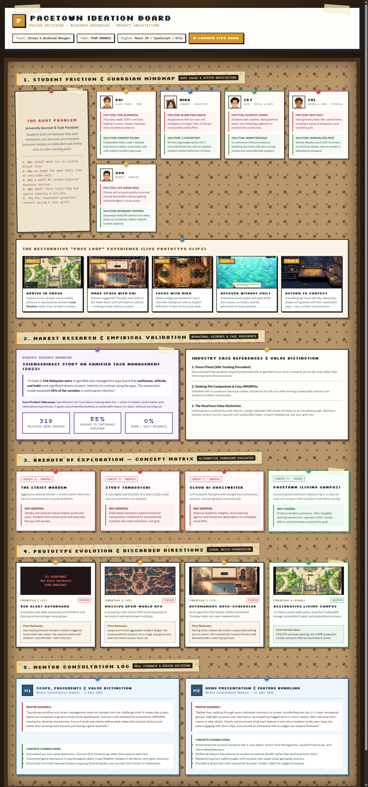
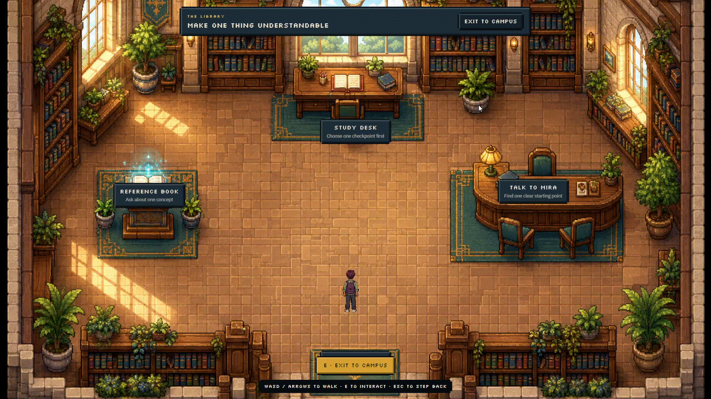
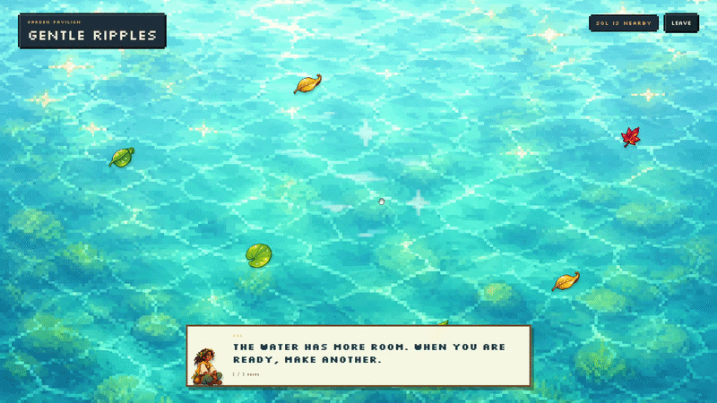
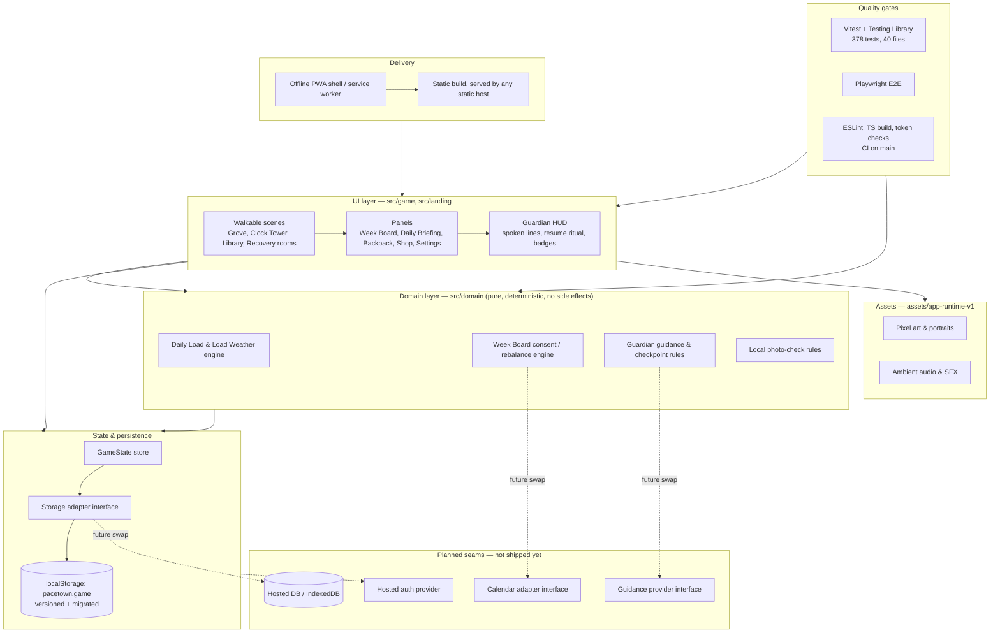

# **PaceTown** by TEAM 1000011

**Team:** TAN HONG SHENG, HEW ZHI HENG, GOH SHENG KAI, CHUAH SHANG LOONG

**Problem Statement:** Stress & Workload Manager

**Video Presentation:** [YouTube Link](https://youtu.be/7Gk2cX9xEKY)

**Presentation Slides:** [Presentation Slides](https://canva.link/kg5wftr8nse7uik)

## **1. Project Overview**

**The Problem.** University stress is rarely caused by a single assignment. It accumulates from classes, deadlines and revision; part time work, commuting, clubs and errands; unclear instructions and work that feels too large to start; difficulty estimating how long things take; context switching and competing priorities; low energy and insufficient recovery; and losing track of where to resume after an interrupted session. The stakeholders are general university students balancing coursework, part time work, social commitments, errands, and their physical and mental wellbeing at the same time.

Similar apps exist, and each falls short in a specific way: traditional planners (such as Notion or Google Calendar) show the work but do not help a student begin it; focus timers (such as Forest or Pomodoro apps) measure time but do not clarify what to do; relaxation games provide a break but leave the underlying responsibility untouched; and general AI assistants can produce content but ignore capacity, scheduling pressure, continuity, and the student's need to remain in control. PaceTown connects these missing pieces and is deliberately never pitched as an upload and complete tool.

**Our Solution.** PaceTown is a cozy, pixel art game where a student's real week becomes a readable campus town. It calculates an explainable Daily Load, proposes safe calendar moves that need explicit approval, turns one scary task into one checkpoint with a guardian beside you, rewards honest stopping and intentional rest, and writes everything down so returning never means reconstructing.

Feature set:

* Plain language week intake with visible parser assumptions and editable commitments
* Explainable Daily Load: weighted demand, load bands, and Load Weather on the map
* Clock Tower with a week long Week Board: consent previews, destination comparison, drag and drop, deadline guards, and undo
* Library: Mira's open work list, blocker routing, single checkpoint proposals, and definitions of done
* Guided Pace Sessions: timers, scratchpad, saved progress notes, contextual help, and completed, partial, blocked, or rescheduled outcomes
* Welcome back desk summary, open work resume badge, and guardian spoken HUD resume ritual
* Guardian picker with routed defaults, one real action button per guardian, and a Guardian Council that proposes without ever applying changes
* Fullscreen recovery scenes (Gentle Ripples, Chime Drift, Warm Cup, Firefly Stories, Night Lanterns) plus the Pocket of Green real world quest with local photo checks
* Private Keepsakes with local pixel filter or symbolic fallback, Collection, Recovery Garden, Future Mailbox, and a week long Journal
* Backpack, Daily Briefing, Town List, Settings, Shop, Quiet Mode, High Contrast, versioned saves, JSON export, and a reset demo shortcut

### Who it serves

General university students, especially those balancing classes with part time work, commuting, clubs, and errands, and students with different energy levels, access needs, and recovery preferences. The system never assumes the same capacity, schedule, social needs, or mobility for everyone: every recovery path has an indoor alternative, every place has a Town List equivalent, and every check in can be skipped.

### Before and after this product

Before: Thursday reads 103% and the student sees only a wall of tasks, so the assignment waits another day. After: the same Thursday reads 95% with consent, one checkpoint has a finish line, a guardian sits through the session, the note and next action are saved, and returning feels like being handed back your own desk.

## **2. Ideation & Process**

### **2.1 Ideas We Considered**

Major alternatives weighed during the project, in decision order. Chosen ideas are listed first.

| Idea | Why it was dropped / kept |
| :---- | :---- |
| A (DROP) — The Strict Warden, Aggressive website blocker + streak tracker that locks devices and penalizes missed deadlines. | Drop: Streaks and lockouts induce shame spirals and panic. Students find workarounds and associate the app with anxiety. |
| B (DROP) — Study Tamagotchi, A cute digital pet that falls ill or dies if daily study sessions and tasks are skipped. | Drop: Guilt-based mechanics exploit emotional manipulation. Unethical for overwhelmed students who need restoration, not guilt. |
| C (DROP) — Cloud AI Ghostwriter, LLM assistant that generates assignment summaries, outlines, and paragraphs automatically. | Drop: Destroys academic integrity, strips learning agency, and introduces dependency on unreliable cloud APIs. |
| D (CHOOSEN) — PaceTown (Living Campus), Consent-gated workload rebalancing in a cozy 2D pixel-art campus with local restorative pacing. | Kept: Protects student autonomy, offers tangible starting momentum, can operates locally offline/optional online mode with AI, and eliminates productivity guilt. |

### **2.2 Ideation Boards**

> 🎨 **Interactive Visual Ideation Board:** [Open Interactive Board (Live Webpage)](https://htmlpreview.github.io/?https://github.com/CSL06/PaceTown/blob/main/ideation-board.html)  
> *(Click the interactive link to explore the live corkboard with animated gameplay anchors, guardian portraits, and full study citations)*

*The PaceTown Ideation Board maps our entire design process from root problem to working vertical slice:*
* **1. Multi-Layer Problem Tree & Guardian Mindmap:** Deconstructs the 5 whys of student burnout (time blindness, cognitive dread, shame, rest guilt, life admin) and branches each to a specialized guardian (Kai, Mira, Sky, Sol, Goh) with its mechanical solution.
* **2. The Restorative Pace Loop:** Traces the 5-phase student journey across live prototype environments (Campus Grove ➔ Clock Tower ➔ Library ➔ Pond ➔ Café) demonstrating how context is preserved without stress.
* **3. Market Research & Behavioral Grounding:** Grounds our gamification in a 2023 ScienceDirect study of 318 Malaysian users (55% continuance variance explained by usefulness and habit) and precedents like *Focus Friend* and cozy MMORPG co-presence.
* **4. Concept Matrix (Breadth of Exploration):** Contrasts PaceTown against 3 dropped alternative paradigms (*The Strict Warden*, *Study Tamagotchi*, *Cloud AI Ghostwriter*), detailing why punitive and auto-completion models were rejected.
* **5. Prototype Evolution Track:** Details our visual and mechanical pivots across 4 iterations (V1 red alert wireframe ➔ V2 sprawling map ➔ V3 autonomous scheduler ➔ V4 consent-gated restorative slice).

---

### **2.3 Mentor Consultation**

| Date | Mentor | Feedback Received | What Was Changed |
| :---- | :---- | :---- | :---- |
| 4 Sept 2026 | Mr. Sim Hong Bing | *"Gamifying workflow and stress management does not deviate from the challenge brief; it makes the project stand out compared to generic productivity dashboards. Ground it with established precedents (MMORPG mechanics, desktop companions, Focus Friend) and clearly define what makes the solution distinct and better than existing tools beyond just having a game aesthetic."* | <ul><li>Articulated our core value distinction: Consent-first rebalancing rather than passive task lists.</ul></li> <ul><li>Connected game mechanics to psychological safety (Load Weather instead of red alerts; zero-guilt recovery).</ul></li> <ul><li>Structured rich multi-layered process mapping illustrating the user journey from friction to restoration. </ul></li>|
| 11 Sept 2026 | Mr. Sim Hong Bing | *"Rather than walking through every individual mechanic or screen, bundle features into 2–3 clear conceptual groups. Highlight purpose over mechanics: avoid getting bogged down in micro-details (like individual form inputs or step clicks). Clearly communicate what each feature is and why it matters to the user. Keep the pace engaging with short clips, and provide an interactive link so judges can explore firsthand."* | <ul><li>Streamlined the product narrative into 3 core pillars: Smart Time Management, Guided Productivity, and Stress Relief/Recovery.</ul></li> <ul><li>Shifted all feature descriptions to student emotional benefit rather than technical form clicks.</ul></li> <ul><li>Replaced long text walkthroughs with focused, bite-sized visual gameplay anchors.</ul></li> <ul><li>Provided a direct one-click interactive launcher (index.html) for judges to explore. </ul></li>|

## **3. Design & Prototype**

**UI Prototype:** [Open UI Prototype](https://pacetown.vercel.app/)

Key screens from the running prototype. 

*The walkable town. Every place is reachable on foot or from the Town List; load shows as weather, not damage.*

*Kai's Week Board opens on a consent preview: softly outlined suggested moves, locked fixed events, before and after loads, and Approve or Dismiss. A manual drag and drop calendar sits underneath.*

*Talk to Mira, choose from the open work list with resume badges, answer the blocker question, use one checkpoint proposal, then work at the study desk with timer, scratchpad, saved notes, and Ask Mira.*

*Gentle Ripples: Tap the pond to make ripples: petals drift, a fish swims, flowers bloom with participation; Watch and relax your mind. No score, no failure, no minimum time; leaving early is valid, and only the first recovery of a run pays.*

*Warm Cup: Choose a drink, pour, stir, and sit by the window in an unruinable four step ritual with Sky keeping quiet company. Same contract as every recovery scene: no score and no wrong order.*

## Guardian System

Guardians are functional product guides. Each specializes in a different
decision; they do not diagnose, judge, or pretend to be an AI homework
replacement.

<table>
  <thead>
    <tr><th>Guardian</th><th>Location</th><th>Role</th><th>What the student gets</th></tr>
  </thead>
  <tbody>
    <tr>
      <td> <strong>Mira</strong></td>
      <td>Library</td><td>Understand</td>
      <td>Brief interpretation, concept explanation, research organization, and a clear checkpoint.</td>
    </tr>
    <tr>
      <td> <strong>Kai</strong></td>
      <td>Clock Tower</td><td>Plan</td>
      <td>Capacity framing, priority decisions, safe calendar moves, and before/after load previews.</td>
    </tr>
    <tr>
      <td> <strong>Sol</strong></td>
      <td>Garden / Park</td><td>Sustain</td>
      <td>Smaller actions, protected breaks, equal recovery choices, and non-clinical capacity support.</td>
    </tr>
    <tr>
      <td> <strong>Sky</strong></td>
      <td>Café</td><td>Accompany</td>
      <td>Quiet body-doubling-style presence, gentle check-ins, and low-pressure encouragement.</td>
    </tr>
    <tr>
      <td> <strong>Goh</strong></td>
      <td>Market</td><td>Complete</td>
      <td>Material gathering, grouped errands, submission checks, and loose-end closure.</td>
    </tr>
  </tbody>
</table>

## **4. What Makes It Different**

* **Consent previews, not auto scheduling.** The engine simulates moves and shows before and after values; nothing mutates until the student approves. Most planners either do nothing or rearrange silently.
* **One checkpoint, not a project plan.** Mira proposes exactly one small step with a visible definition of done; Make it smaller is always one click.
* **Return is a designed moment.** Welcome back desk summary, open work resume badge, and a guardian spoken HUD card (task, checkpoint, time, last note, next action). No other student tool treats resuming as a first class feature.
* **Honest stopping is rewarded.** Partial, blocked, and rescheduled are valid, paid outcomes; the first recovery pays once and can never be farmed.
* **IRL Minigame Recovery.** Provides the user the option to actually step outside, away from their work physically, and go out to see the world. Take a memorable photo as an checkpoint, and turns it into an in-game collection. Self confirmation and photo confirmation earn identically.
* **Deterministic and offline.** Every number is explainable and every AI style feature has a local fallback, so it cannot break on connectivity.

 ### **Comparison against the named existing solutions:**

|  | PaceTown | Planners / timers | Relaxation games | General AI assistants |
| --- | --- | --- | --- | --- |
| Shows total load | Yes, explained | Partially | No | No |
| Helps begin work | Yes, one checkpoint | Rarely | No | Sometimes, no capacity awareness |
| Safe rescheduling | Yes, consent previews | Manual only | N/A | No |
| Preserves context | Yes, resume ritual | Rarely | No | No |
| Rest without guilt | Yes, rewarded once | No | Yes, but responsibility untouched | No |

## **5. Technical Architecture & Feasibility**

### **Tech stack (current demo prototype)**

| Layer | Choice | Why we chose it | Constraints expected |
| --- | --- | --- | --- |
| Frontend | React + TypeScript + Vite | Component model fits panels and scenes; strict types catch state shape drift; fast dev loop for a demo | Bundle size grows with scenes; code splitting used on heavy routes |
| Town rendering | Layered DOM and CSS pixel art, no game engine | Keeps the build light, testable with Testing Library, and accessible (keyboard, focus, screen reader) | Not a full engine; complex physics or map work would need a rework |
| Persistence | localStorage behind a storage adapter (pacetown.game, versioned and migrated) | Zero backend for the slice; single device demo works offline | Single device only; IndexedDB or a server is an explicit later swap |
| Auth | Browser only local accounts and guest demo path | No hosted auth to operate; guest path opens the demo in one click | Clearly not production authentication; a hosted provider is a later adapter |
| Tests | Vitest, jsdom, and Testing Library (378 tests, 40 files); Playwright E2E | jsdom covers panels and scenes fast; Playwright covers real browser flows | Playwright browsers must be installed locally for E2E |
| Quality gates | ESLint, token checks, TypeScript build, Vitest, and Vite build in CI | Catches drift before merge; all green on main | CI needs Node 24; offline PWA shell registers in production builds only |
| Hosting | Static build (dist, git ignored) served by any static host; npm run preview locally | No server code exists, so any static host works | No backend, so nothing to scale; deployment infrastructure is outside the slice |

### **Tech stack (planned for future phases)**

None of the following is needed for the current slice to run (since it was a prototype for current slice), each one plugs into a seam the code already leaves open, so adding it later means **extending the build, not rewriting it**.

| Layer | Planned choice | Why it's next | Constraint to expect |
| --- | --- | --- | --- |
| Persistence | IndexedDB, or a small hosted database (e.g. Postgres), behind the same storage adapter | A save needs to follow a student across devices, not just survive a refresh | Introduces a real backend with its own uptime and cost to manage |
| Auth | Hosted auth provider (e.g. Supabase Auth) | Multi-device sync needs a way to recognise "the same student" across sessions | Adds an account system that has to be operated and secured |
| Calendar | Live Google Calendar / Outlook integration behind a calendar adapter | Replaces seeded demo data with a student's real week | Needs OAuth, rate limits, and a graceful fallback if the API is unreachable |
| Guardian guidance | An cloud LLM behind the existing guidance provider interface | Covers open-ended questions the deterministic rules can't anticipate | Adds latency, cost, and a network dependency the offline demo doesn't have today |
| Distribution | Android packaging (e.g. Capacitor) wrapping the existing PWA | Reaches students who default to an app store instead of a browser | Doubles the release surface that has to be tested and maintained |
| Hosting | A small serverless API in front of the hosted database | The only new backend surface needed once sync and auth exist | A genuinely new moving part, so it's deferred until sync is actually required |

**System architecture diagram**

**Build plan & scope**

Already built in this slice, grouped the way we pitch it: three pillars, not a feature dump:

* **Smart Time Management:** plain-language week intake and parsing, the explainable Daily Load and Load Weather system, and the Clock Tower Week Board with its consent previews, drag-and-drop, deadline guards, and undo.
* **Guided Productivity:** the Library's guided work loop (blocker routing, single-checkpoint proposals, definitions of done), Guided Pace Sessions with timers and saved progress notes, and welcome-back continuity so returning never means reconstructing.
* **Stress Relief & Recovery:** all five recovery scenes, the Pocket of Green real-world quest with local photo checks, the keepsake pipeline, Journal, Future Mailbox, and the Recovery Garden.

Underneath all three: the Guardian picker and Council, Backpack, Settings, Shop, accessibility (Quiet Mode, High Contrast, Town List), versioned saves, JSON export, a reset demo shortcut, and the offline PWA shell.

Explicitly out of scope for this slice and will implement for future phase:

* Hosted authentication and multi-device sync
* IndexedDB or a server-backed repository
* Live Google Calendar integration
* Cloud AI conversations for guardian help
* Deep shop progression and production town upgrades
* The full Recovery Garden catalog and long-term social features
* Production deployment infrastructure

**Resources and time**

A four-person student team built this slice with zero-cost tooling which are React, TypeScript, Vite, Vitest, Testing Library, and Playwright, then hosted for free as a static site, with all art either made in-house or sourced from credited packs. Frontend, domain modeling, the pixel art pipeline, and QA all stayed inside the team, with no outside contractors or paid services involved. The scope was deliberately narrowed to one campus loop because that's what honestly fits a hackathon window; every feature we deferred already has a named seam waiting for it, a storage adapter, a guidance provider interface, a data-driven districts system, so a follow-up build starts from working code, not a blank page.

**Where it can go next**

The core loop is built to scale without a redesign. The nearest additions are more student groups with different capacity profiles, the Coastal Commons and Night Market districts already mapped out during ideation (sharing the same data and progression as Campus Grove), and institution onboarding that imports a student's real week instead of a seeded one. Because the app already installs as a Progressive Web App (PWA), distribution can grow before any backend does. And because every one of these steps reuses the same consent, parity, and no-shame contracts the current build already honors, growing PaceTown never means quietly weakening what it promises students today.
