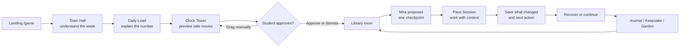
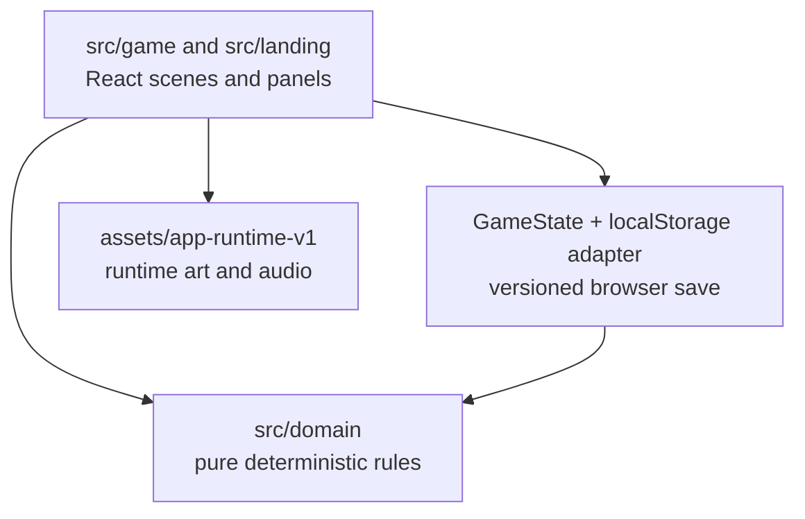

# PaceTown


<p align="center">
  <strong>A calm, local-first guided-work and recovery game for university students.</strong><br />
  Make the week understandable. Make one task startable. Return without losing your place.
</p>

<p align="center">
  <a href="https://github.com/CSL06/PaceTown/actions"></a>
  
  
  
</p>

PaceTown turns a student's real commitments into a readable campus world:
schedule pressure becomes weather and load, flexible work can be moved with
consent, difficult work becomes one checkpoint, guardians provide contextual
support, recovery stays equal and optional, and the Journal preserves what
happened for next time.

> This repository contains a functional browser prototype. It does not require
> a cloud backend, AI provider, or Google Calendar connection.

## Contents

- [Product Flow](#product-flow)
- [What Is Included](#what-is-included)
- [Guardian System](#guardian-system)
- [Routes](#routes)
- [Run Locally](#run-locally)
- [Presenter Demo](#presenter-demo)
- [Architecture](#architecture)
- [Privacy and Data](#privacy-and-data)
- [Quality](#quality)
- [Assets](#assets)
- [Project Documents](#project-documents)
- [Scope](#scope)

## Product Flow



The core loop is intentionally small:

```text
Understand the week
    → move what can safely move
    → choose one real task
    → make one checkpoint
    → work with a guardian
    → recover intentionally
    → return with the next action intact
```

PaceTown is not a productivity scoreboard. It has no streak pressure, missed-
day messaging, health score, or automatic academic completion. A partial
session, a realistic reschedule, a recovery choice, and stopping intentionally
are all valid outcomes.

## What Is Included

| Area | Current capability |
| --- | --- |
| **Understand** | Natural-language intake, visible parser assumptions, editable commitments, Daily Load arithmetic, bands, and Load Weather |
| **Make space** | Walkable Clock Tower, seven-day Week Board, Kai's consent preview, destination comparison, drag/drop, deadline guards, and undo |
| **Do the work** | Walkable Library, Mira's open-work list, task guidance, blocker routing, one checkpoint, definition of done, timer, scratchpad, and contextual help |
| **Return** | Welcome-back desk summary, open-work resume badge, HUD resume card, saved notes, next action, and Journal timeline |
| **Recover** | Full-screen Gentle Ripples, Chime Drift, Warm Cup, Firefly Stories, Night Lanterns, plus Pocket of Green IRL recovery |
| **Remember** | Local photo heuristics, privacy-aware Keepsakes, pixel filter/symbolic fallback, Collection, Recovery Garden, and Future Mailbox |
| **Operate** | Town List, Guardian Council, Daily Briefing, Backpack, Settings, Shop, Quiet Mode, High Contrast, export, and `/reset` |

## Guardian System

Guardians are functional product guides. Each specializes in a different
decision; they do not diagnose, judge, or pretend to be an AI homework
replacement.

<table>
  <thead>
    <tr><th>Guardian</th><th>Location</th><th>Role</th><th>What the student gets</th></tr>
  </thead>
  <tbody>
    <tr>
      <td><br /><strong>Mira</strong></td>
      <td>Library</td><td>Understand</td>
      <td>Brief interpretation, concept explanation, research organization, and a clear checkpoint.</td>
    </tr>
    <tr>
      <td><br /><strong>Kai</strong></td>
      <td>Clock Tower</td><td>Plan</td>
      <td>Capacity framing, priority decisions, safe calendar moves, and before/after load previews.</td>
    </tr>
    <tr>
      <td><br /><strong>Sol</strong></td>
      <td>Garden / Park</td><td>Sustain</td>
      <td>Smaller actions, protected breaks, equal recovery choices, and non-clinical capacity support.</td>
    </tr>
    <tr>
      <td><br /><strong>Sky</strong></td>
      <td>Café</td><td>Accompany</td>
      <td>Quiet body-doubling-style presence, gentle check-ins, and low-pressure encouragement.</td>
    </tr>
    <tr>
      <td><br /><strong>Goh</strong></td>
      <td>Market</td><td>Complete</td>
      <td>Material gathering, grouped errands, submission checks, and loose-end closure.</td>
    </tr>
  </tbody>
</table>

Guardian routing follows the selected blocker or task intent. Guidance is
local, deterministic, editable, and clearly separated from the student's own
work. The Guardian Council combines relevant specialties into one foreground
recommendation while preserving student choice.

## Routes

| Route | Purpose |
| --- | --- |
| `/` | Landing page, live town, product introduction, and primary guest entry |
| `/signup` | Browser-only account creation and guest-to-account upgrade |
| `/login` | Browser-only sign-in and simulated Google profile flow |
| `/welcome` | Skippable four-step onboarding: capacity, day intake, recovery preferences, accessibility |
| `/town` | Authenticated Campus Grove experience |
| `/game` | Presenter front door; creates a guest session and opens the seeded week |
| `/demo` | Narrow legacy mentor demo with Sky and guided breathing |
| `/reset` | Developer/presenter shortcut; clears the game save and session, then opens `/game` |

## Run Locally

### Requirements

- Node.js 24 or newer
- npm 10 or newer

### Setup

```powershell
git clone https://github.com/CSL06/PaceTown.git
cd PaceTown
npm install
npm run dev
```

Open the URL printed by Vite. The usual address is
`http://localhost:5173/`.

### Commands

```powershell
npm run dev          # development server
npm run lint         # ESLint
npm run check:tokens # design-token validation
npm run typecheck    # TypeScript build check
npm test             # Vitest suite
npm run test:watch   # Vitest watch mode
npm run build        # production typecheck + Vite build
npm run preview      # serve dist locally
npm run test:e2e     # Playwright browser suite, when browsers are installed
```

For a clean presenter run:

```text
http://localhost:5173/reset
```

`/reset` clears the game save and active session, then redirects to `/game`.
Home and Settings provide the user-facing export and delete/reset controls.

## Presenter Demo

The canonical recording guide is [`prototypeflow.md`](prototypeflow.md). It is
organized as eleven connected recording takes with explicit `ACTION`, `SAY`,
developer notes, and handoffs to the next take.

Short version:

1. `/reset` → `/game` → Kai's first-run introduction → Town Hall.
2. Save commitments and explain the live Daily Load calculation.
3. Clock Tower → Kai's consent preview → compare → approve or dismiss.
4. Library → Mira → open work → blocker → one checkpoint → study desk.
5. Pace Session → task-specific question → progress note → next action.
6. Welcome Back → resume with task, note, next action, and elapsed time intact.
7. Gentle Ripples or Pocket of Green → Keepsake → seven-day Journal.

## Architecture



The project uses a one-way boundary:

- `src/domain/` owns calculations, policies, guidance, parsing, workload,
  calendar, rebalance, rewards, recovery, photo, and Keepsake rules.
- `src/game/` owns React scenes, panels, navigation, persistence, movement,
  accessibility, and presentation.
- `src/landing/` owns the public product introduction and live campus preview.
- `src/auth/` owns the local browser-only account/session seam.
- `src/theme/` owns light/dark theme tokens and pixel typography.

Important domain modules:

| Module | Responsibility |
| --- | --- |
| `workload.ts` | Capacity, weighted demand, percentages, bands, and energy guidance |
| `parse.ts` | Local schedule and assignment-brief parsing |
| `calendar.ts` | Week-day placement, ordering, and movement |
| `rebalance.ts` | Safe move proposals and explicit application |
| `plans.ts` | Blocker routing, checkpoints, guardians, and checkpoint resolution |
| `taskGuidance.ts` | Deterministic task-aware checkpoint proposals |
| `guidance.ts` | Contextual help modes and guardian lenses |
| `quests.ts` | Quest selection and one foreground recommendation |
| `regulation.ts` | Recovery catalogue and preference policy |
| `photo.ts` / `keepsake.ts` | Local photo checks and privacy-aware memory creation |
| `rewards.ts` | XP, coins, levels, and reward parity |

## Product Guarantees

- **Explainable numbers:** every load percentage has a deterministic formula.
- **Explicit consent:** rebalance previews never mutate the schedule until approved.
- **No automatic academic completion:** timers, recovery activities, and guardian suggestions never complete academic work.
- **Equal recovery paths:** self-confirmation, optional photos, digital activities, and IRL activities do not create reward advantages.
- **No shame mechanics:** no streaks, missed-day warnings, mood scores, or diagnosis.
- **Continuity:** task, checkpoint, scratchpad, progress note, next action, and timer context survive return.
- **Privacy by construction:** photos are optional, locally inspected, and never treated as proof of identity, location, duration, or mood.

## Data and Privacy

- Game data is stored under `pacetown.game` in browser `localStorage`.
- Account data is stored locally under `pacetown.accounts` and `pacetown.session`.
- Saves are versioned and migrated forward; missing fields use safe defaults.
- Photos are optional and checked locally for greenery/daylight heuristics only.
- A Keepsake never proves that a recovery quest happened.
- No external AI, cloud sync, Google Calendar, or server API is required.
- Home and Settings provide export and deletion controls.

## Testing and Quality

The current suite contains **378 passing tests across 40 files**. It includes:

- Domain arithmetic, bands, calendar, rebalance, guidance, rewards, and migrations
- Task guidance and guardian routing
- Clock Tower movement, proposal preview, drag/drop, deadlines, and undo
- Library task flow, checkpoint proposals, session outcomes, and continuity
- Full-screen recovery activity scenes and response completion
- Pocket photo verification, Keepsake consent, and reward parity
- Seven-day Journal bucketing and neutral empty-day behavior
- Landing, authentication, onboarding, themes, settings, error logging, and UI behavior
- Runtime reset, save export, resume cards, and accessibility affordances

Run the CI-equivalent checks locally:

```powershell
npm run lint
npm run check:tokens
npm run typecheck
npm test
npm run build
```

`npm run test:e2e` runs the Playwright browser suite when its browser
environment is installed. GitHub Actions runs lint, typecheck, unit/component
tests, and the production build on pushes and pull requests.

## Assets

Runtime artwork is sourced from `assets/app-runtime-v1/`, including:

- Campus world, Library, Clock Tower, Recovery scenes, and Week Board artwork
- Player and five guardian portrait/sprite packages
- Recovery atlases for Ripples, Chime Drift, Warm Cup, Firefly Stories, and Night Lanterns
- PWA icons and the README hero card

Downloaded third-party packs and archives are intentionally excluded from Git.
See [`assets/third-party/ASSET_MANIFEST.md`](assets/third-party/ASSET_MANIFEST.md)
for source links, intended use, and license instructions.

## Project Documents

- [`PACETOWN_PROJECT_VISION.md`](PACETOWN_PROJECT_VISION.md) — product vision, principles, and guarantees
- [`PaceTown_Hackathon_Implementation_Plan.md`](PaceTown_Hackathon_Implementation_Plan.md) — implementation requirements and contracts
- [`prototypeflow.md`](prototypeflow.md) — current presenter recording script and developer notes
- [`CAMPUS_GROVE.md`](CAMPUS_GROVE.md) — Campus Grove usage and architecture notes
- [`DESIGN.md`](DESIGN.md) — visual and interaction design system
- [`assets/PACETOWN_ASSET_COMPLETION_CHECKLIST.md`](assets/PACETOWN_ASSET_COMPLETION_CHECKLIST.md) — asset status and validation

## Scope

The prototype intentionally leaves these production adapters out:

- Hosted authentication and multi-device synchronization
- IndexedDB or server-backed repositories
- Live Google Calendar integration
- Cloud AI conversations
- Deep shop/catalog progression and production town upgrades
- Full Recovery Garden catalog and long-term social features
- Android packaging and production deployment infrastructure
