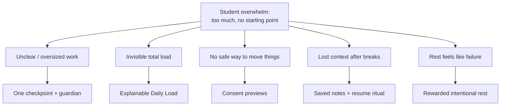
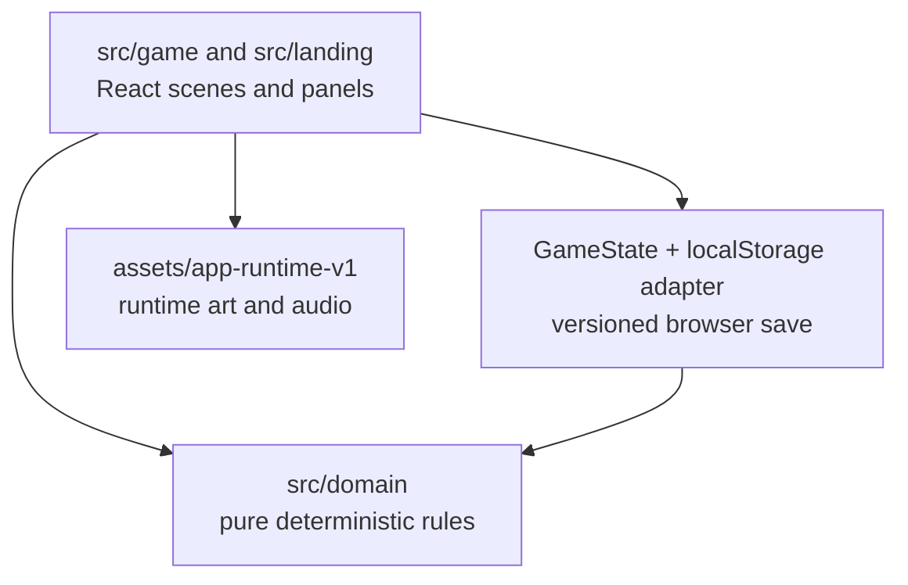

# **PaceTown** by [Team Name]

**Team:** [Member 1], [Member 2], [Member 3], [Member 4]

**Problem Statement:** Stress & Workload Manager

**Video Presentation:** [Unlisted Youtube Link]

**Presentation Slides:** [Public Link]

## **1. Project Overview**

**The Problem.** University stress is rarely caused by a single assignment — it accumulates from classes, deadlines and revision; part-time work, commuting, clubs and errands; unclear instructions and work that feels too large to start; bad time estimates; context switching and competing priorities; low energy and insufficient recovery; and losing track of where to resume after an interrupted session. The stakeholders are general university students balancing coursework, jobs, social life, errands, and wellbeing at the same time.

Similar apps exist, and each misses a piece: traditional planners show the work but don't help a student *begin* it; focus timers measure time but don't clarify *what to do*; relaxation games provide a break but leave the underlying responsibility untouched; general AI assistants can produce content but ignore capacity, scheduling pressure, continuity, and the student's need to remain in control. PaceTown connects these missing pieces — and is deliberately never pitched as "upload an assignment and let AI complete it."

**Our Solution.** PaceTown is a cozy, local-first pixel-art game where a student's real week becomes a readable campus town. It calculates an explainable Daily Load, proposes safe calendar moves that need explicit approval, turns one scary task into one checkpoint with a guardian beside you, rewards honest stopping and intentional rest, and writes everything down so returning never means reconstructing. No cloud, no AI provider, and no streaks required.

Feature set:

- Natural-language week intake with visible parser assumptions and editable commitments
- Explainable Daily Load (weighted demand, bands, Load Weather on the map)
- Walkable Clock Tower with a seven-day Week Board: consent previews, destination comparison, drag-drop, deadline guards, undo
- Walkable Library: Mira's open-work list, blocker routing, one-checkpoint proposals, definitions of done
- Guided Pace Sessions: timers, scratchpad, saved progress notes, contextual help, completed / partial / blocked / rescheduled outcomes
- Welcome-back desk summary, open-work resume badge, and guardian-voiced HUD resume ritual
- Guardian picker with routed defaults, one real action button per guardian, and a Guardian Council that proposes without ever applying
- Full-screen recovery scenes (Gentle Ripples, Chime Drift, Warm Cup, Firefly Stories, Night Lanterns) plus the Pocket of Green IRL quest with local photo checks
- Private Keepsakes (local pixel filter or symbolic fallback), Collection, Recovery Garden, Future Mailbox, and a seven-day Journal
- Backpack, Daily Briefing, Town List, Settings, Shop, Quiet Mode, High Contrast, versioned saves, JSON export, and a `/reset` demo shortcut

## **2. Ideation & Process**

### **2.1 Ideas We Considered**

Major alternatives weighed during the project, as recorded in the repo docs (`PACETOWN_PROJECT_VISION.md`, `PaceTown_Hackathon_Implementation_Plan.md`):

| Idea | Why it was dropped / kept |
| :---- | :---- |
| A (Chosen) — One campus (Campus Grove), one player, one complete understand → make-space → work → recover → return loop | Kept: the smallest slice that still demonstrates the full product promise end to end |
| B (Chosen) — Deterministic local-first rules for everything (parsing, load, rebalance, guidance, photo checks) | Kept: runs with no cloud or AI; every AI-assisted feature has a local fallback, so the demo cannot break on connectivity |
| C (Chosen) — Guardians as functional companions with distinct actions, plus consent-gated everything | Kept: differentiates the product from dashboards and mascot apps; every change needs explicit approval |
| D — Coastal Commons and Night Market as extra environments | Dropped for the slice (documented as post-core progression goals sharing all data and progression) |
| E — Full game engine (Phaser) for the town renderer | Dropped: layered DOM/CSS town keeps the build light and testable; Phaser atlases reused as build-time frame data only |
| F — Live Google Calendar integration | Deferred: seeded calendar data stands in; the adapter seam is kept for later |
| G — Cloud AI conversations for guardian help | Deferred: deterministic local guidance ships instead; remote provider can be swapped in behind the same interface |

### **2.2 Ideation Boards**

*[Attach 1–2 board images here — e.g. exported PNGs from your whiteboard tool. Recommended: one problem tree and one user-flow board.]*

*What it shows: [1–2 lines — e.g. how the team mapped accumulated student demands to town systems].*

*What it shows: [1–2 lines — e.g. the first-run user flow from landing to resume ritual].*

The problem tree behind the design, derived from the vision doc:

### **2.3 Mentor Consultation**

| Date | Mentor | Feedback Received | What Was Changed |
| :---- | :---- | :---- | :---- |
| [Date] | [Name] | [Feedback] | [Change, or why it was respectfully declined] |
| [Date] | [Name] | [Feedback] | [Change, or why it was respectfully declined] |

## **3. Design & Prototype**

**UI Prototype:** [ Public Link — Figma/Canva/Netlify/Vercel; check it opens incognito ]

Key screens from the running prototype (replace with ordered screenshots from your demo run; the art below is the shipped runtime artwork for each scene):

*The walkable town — every place is reachable on foot or from the Town List; load shows as weather, not damage.*

*Kai's Week Board opens on a consent preview: softly outlined suggested moves, locked fixed events, before/after loads, approve or dismiss — plus a manual drag-drop calendar underneath.*

*Talk to Mira → open-work list with resume badges → blocker question → one checkpoint proposal → study-desk session with timer, scratchpad, saved notes, and Ask Mira.*

*Mira (Library · Understand) — brief interpretation, concept explanation, and checkpoint creation; four more guardians cover Plan (Kai), Sustain (Sol), Accompany (Sky), and Complete (Goh).*

## **4. What Makes It Different**

- **Consent previews, not auto-scheduling.** The engine simulates moves and shows before/after values; nothing mutates until the student approves. Most planners either do nothing or rearrange silently.
- **One checkpoint, not a project plan.** Mira proposes exactly one small step with a visible definition of done; "Make it smaller" is always one click.
- **Return is a designed moment.** Welcome-back desk summary, open-work resume badge, and a guardian-voiced HUD card (task, checkpoint, time, last note, next action) — no other student tool treats resuming as a first-class feature.
- **Honest stopping is rewarded.** Partial, blocked, and rescheduled are valid, paid outcomes; the first recovery pays once and can never be farmed.
- **Photo parity.** Self-confirmation and photo confirmation earn identically; keepsakes never prove a quest happened.
- **Deterministic and offline.** Every number is explainable and every AI-shaped feature has a local fallback — the demo cannot break on connectivity.

|  | PaceTown | Planners / timers | Relaxation games | General AI assistants |
| --- | --- | --- | --- | --- |
| Shows total load | Yes, explained | Partially | No | No |
| Helps begin work | Yes, one checkpoint | Rarely | No | Sometimes, no capacity awareness |
| Safe rescheduling | Yes, consent previews | Manual only | N/A | No |
| Preserves context | Yes, resume ritual | Rarely | No | No |
| Rest without guilt | Yes, rewarded once | No | Yes, but responsibility untouched | No |

## **5. Technical Architecture & Feasibility**

**Tech stack**

| Layer | Choice | Why + constraints |
| --- | --- | --- |
| Frontend | React + TypeScript + Vite | Component model fits panels/scenes; strict types catch state-shape drift; fast dev loop for a demo |
| Town rendering | Layered DOM/CSS pixel art, no game engine | Keeps the build light, testable with Testing Library, and accessible (keyboard, focus, screen reader) |
| Persistence | `localStorage` behind a storage adapter (`pacetown.game`, versioned + migrated) | Zero backend for the slice; single-device only — IndexedDB/server is an explicit later swap |
| Auth | Browser-only local accounts + guest demo path | No hosted auth to operate; clearly not production authentication |
| Tests | Vitest + jsdom + Testing Library (378 tests, 40 files); Playwright E2E present | jsdom covers panels/scenes; browser tests need Playwright browsers installed |
| Quality gates | ESLint, token checks, `tsc -b`, Vitest, `vite build` in CI | All green on main; offline PWA shell registers in production builds only |
| Hosting | Static build (`dist/`, git-ignored) served anywhere; `npm run preview` locally | No server code exists, so any static host works |

**Build plan & scope**

Already built in this slice: intake + parsing, Daily Load + Load Weather, Clock Tower Week Board with consent flow, Library guided-work loop with sessions and outcomes, welcome-back continuity, all five recovery scenes, Pocket of Green with local photo checks, keepsake pipeline, Journal/Mailbox/Backpack/Council/Garden, settings/shop/accessibility, versioned saves, export, `/reset`, and the offline shell.

Explicitly out of scope: hosted auth and multi-device sync, IndexedDB/server repositories, live Google Calendar, cloud AI conversations, deep shop progression, full garden catalog, Android packaging, and production deployment infrastructure.
