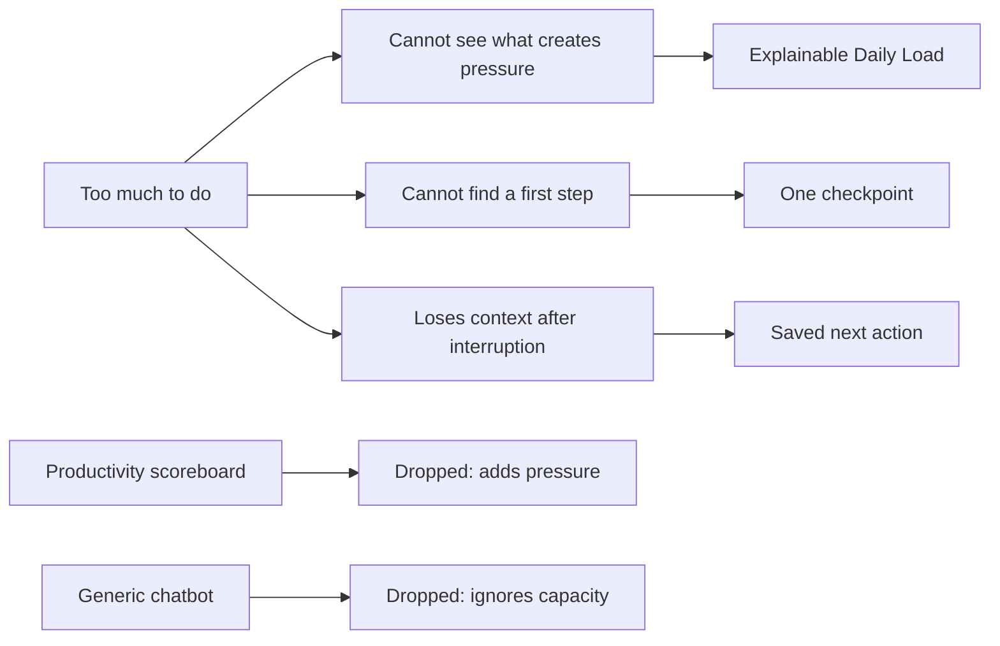
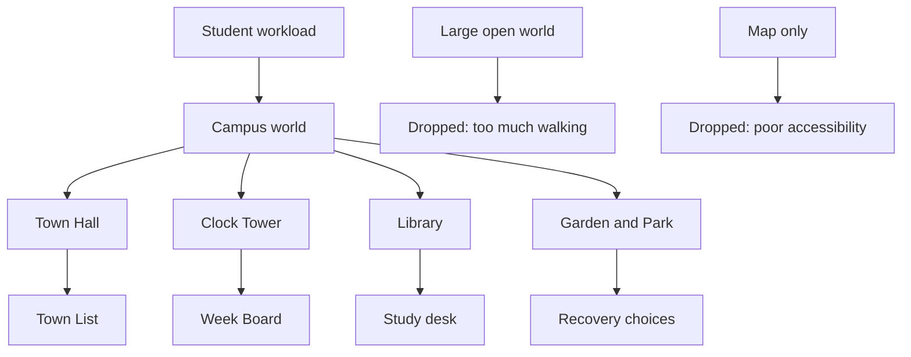
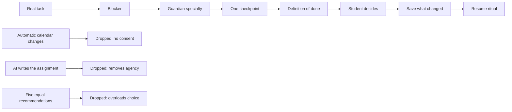
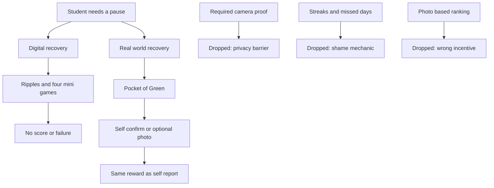
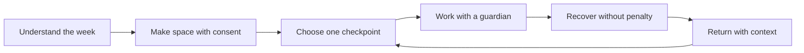
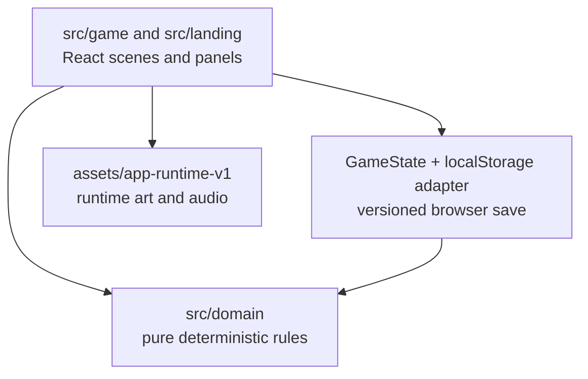

# **PaceTown** by TEAM 1000011

**Team:** TAN HONG SHENG, HEW ZHI HENG, GOH SHENG KAI, CHUAH SHANG LOONG

**Problem Statement:** Stress & Workload Manager

**Video Presentation:** [Unlisted Youtube Link]

**Presentation Slides:** [Public Link]

## **1. Project Overview**

**The Problem.** University stress is rarely caused by a single assignment. It accumulates from classes, deadlines and revision; part time work, commuting, clubs and errands; unclear instructions and work that feels too large to start; difficulty estimating how long things take; context switching and competing priorities; low energy and insufficient recovery; and losing track of where to resume after an interrupted session. The stakeholders are general university students balancing coursework, part time work, social commitments, errands, and their physical and mental wellbeing at the same time.

Similar apps exist, and each falls short in a specific way: traditional planners (such as Notion or Google Calendar) show the work but do not help a student begin it; focus timers (such as Forest or Pomodoro apps) measure time but do not clarify what to do; relaxation games provide a break but leave the underlying responsibility untouched; and general AI assistants can produce content but ignore capacity, scheduling pressure, continuity, and the student's need to remain in control. PaceTown connects these missing pieces and is deliberately never pitched as an upload and complete tool.

**Our Solution.** PaceTown is a cozy, browser only pixel art game where a student's real week becomes a readable campus town. It calculates an explainable Daily Load, proposes safe calendar moves that need explicit approval, turns one scary task into one checkpoint with a guardian beside you, rewards honest stopping and intentional rest, and writes everything down so returning never means reconstructing. No cloud, no AI provider, and no streaks required.

Feature set:

* Plain language week intake with visible parser assumptions and editable commitments
* Explainable Daily Load: weighted demand, load bands, and Load Weather on the map
* Walkable Clock Tower with a week long Week Board: consent previews, destination comparison, drag and drop, deadline guards, and undo
* Walkable Library: Mira's open work list, blocker routing, single checkpoint proposals, and definitions of done
* Guided Pace Sessions: timers, scratchpad, saved progress notes, contextual help, and completed, partial, blocked, or rescheduled outcomes
* Welcome back desk summary, open work resume badge, and guardian spoken HUD resume ritual
* Guardian picker with routed defaults, one real action button per guardian, and a Guardian Council that proposes without ever applying changes
* Fullscreen recovery scenes (Gentle Ripples, Chime Drift, Warm Cup, Firefly Stories, Night Lanterns) plus the Pocket of Green real world quest with local photo checks
* Private Keepsakes with local pixel filter or symbolic fallback, Collection, Recovery Garden, Future Mailbox, and a week long Journal
* Backpack, Daily Briefing, Town List, Settings, Shop, Quiet Mode, High Contrast, versioned saves, JSON export, and a reset demo shortcut

## **2. Ideation & Process**

### **2.1 Ideas We Considered**

Major alternatives weighed during the project, in decision order. Chosen ideas are listed first.

| Idea | Why it was dropped / kept |
| :---- | :---- |
| A (Chosen) — One campus (Campus Grove), one player, one complete understand, make space, work, recover, return loop | Kept: the smallest slice that still demonstrates the full product promise end to end |
| B (Chosen) — Deterministic browser only rules for everything (parsing, load, rebalance, guidance, photo checks) | Kept: runs with no cloud or AI; every assisted feature has a local fallback, so the demo cannot break on connectivity |
| C (Chosen) — Guardians as functional companions with distinct actions, plus consent gated changes | Kept: differentiates the product from dashboards and mascot apps; every change needs explicit approval |
| D — Coastal Commons and Night Market as extra environments | Dropped for the slice; documented as post core progression goals that share all data and progression |
| E — Full game engine (Phaser) for the town renderer | Dropped: a layered DOM and CSS town keeps the build light and testable; Phaser atlases are reused as build time frame data only |
| F — Live Google Calendar integration | Deferred: seeded calendar data stands in; the adapter seam is kept for later |
| G — Cloud AI conversations for guardian help | Deferred: deterministic local guidance ships instead; a remote provider can be swapped in behind the same interface |

### **2.2 Ideation Boards**

The team explored the problem from four different perspectives before
combining the ideas into one vertical slice. These boards intentionally show
early uncertainty, discarded directions, and the decisions that survived.

#### Board 1: Member 1, problem framing

**Focus:** Why do existing planners fail to help students start?

**Decision:** keep the problem focused on accumulated pressure and lost
context, not only assignment completion. This became the product loop:
understand, make space, work, recover, return.

#### Board 2: Member 2, world and interaction

**Focus:** How can planning feel like a place rather than another dashboard?

**Decision:** keep the walkable pixel campus, but provide a Town List so
every place has a direct keyboard and screen reader path. Each location was
given one clear purpose and one understandable next action.

#### Board 3: Member 3, planning and guidance

**Focus:** How can the system give useful help without taking control?

**Decision:** use blocker routing and deterministic task guidance to propose
one editable checkpoint. The student can accept, make it smaller, pause,
reschedule, or choose another direction. Guardians support decisions rather
than replacing them.

#### Board 4: Member 4, recovery and privacy

**Focus:** How can recovery help without becoming another score system?

**Decision:** keep digital and real world recovery as equal paths. Photos are
optional, checked locally for visible nature like greenery or daylight, and
never used to prove location, identity, duration, mood, or quality.

#### Synthesis: from four boards to one prototype

The first build therefore prioritised one complete campus loop over a large
catalogue of disconnected features. Every dropped idea remains visible in
the boards because it explains why the final scope is realistic for a
hackathon prototype.

### **2.3 Mentor Consultation**

| Date | Mentor | Feedback Received | What Was Changed |
| :---- | :---- | :---- | :---- |
| [Date] | [Name] | [Feedback] | [Change made, or why it was respectfully declined] |
| [Date] | [Name] | [Feedback] | [Change made, or why it was respectfully declined] |

## **3. Design & Prototype**

**UI Prototype:** [ Public Link. Check that it opens in an incognito window ]

Key screens from the running prototype. 

*The walkable town. Every place is reachable on foot or from the Town List; load shows as weather, not damage.*

*Kai's Week Board opens on a consent preview: softly outlined suggested moves, locked fixed events, before and after loads, and Approve or Dismiss. A manual drag and drop calendar sits underneath.*

*Talk to Mira, choose from the open work list with resume badges, answer the blocker question, use one checkpoint proposal, then work at the study desk with timer, scratchpad, saved notes, and Ask Mira.*

## Guardian System

Guardians are functional product guides. Each specializes in a different
decision; they do not diagnose, judge, or pretend to be an AI homework
replacement.

<table>
  <thead>
    <tr><th>Guardian</th><th>Location</th><th>Role</th><th>What the student gets</th></tr>
  </thead>
  <tbody>
    <tr>
      <td> <strong>Mira</strong></td>
      <td>Library</td><td>Understand</td>
      <td>Brief interpretation, concept explanation, research organization, and a clear checkpoint.</td>
    </tr>
    <tr>
      <td> <strong>Kai</strong></td>
      <td>Clock Tower</td><td>Plan</td>
      <td>Capacity framing, priority decisions, safe calendar moves, and before/after load previews.</td>
    </tr>
    <tr>
      <td> <strong>Sol</strong></td>
      <td>Garden / Park</td><td>Sustain</td>
      <td>Smaller actions, protected breaks, equal recovery choices, and non-clinical capacity support.</td>
    </tr>
    <tr>
      <td> <strong>Sky</strong></td>
      <td>Café</td><td>Accompany</td>
      <td>Quiet body-doubling-style presence, gentle check-ins, and low-pressure encouragement.</td>
    </tr>
    <tr>
      <td> <strong>Goh</strong></td>
      <td>Market</td><td>Complete</td>
      <td>Material gathering, grouped errands, submission checks, and loose-end closure.</td>
    </tr>
  </tbody>
</table>

## **4. What Makes It Different**

* **Consent previews, not auto scheduling.** The engine simulates moves and shows before and after values; nothing mutates until the student approves. Most planners either do nothing or rearrange silently.
* **One checkpoint, not a project plan.** Mira proposes exactly one small step with a visible definition of done; Make it smaller is always one click.
* **Return is a designed moment.** Welcome back desk summary, open work resume badge, and a guardian spoken HUD card (task, checkpoint, time, last note, next action). No other student tool treats resuming as a first class feature.
* **Honest stopping is rewarded.** Partial, blocked, and rescheduled are valid, paid outcomes; the first recovery pays once and can never be farmed.
* **Photo parity.** Self confirmation and photo confirmation earn identically; keepsakes never prove a quest happened.
* **Deterministic and offline.** Every number is explainable and every AI style feature has a local fallback, so the demo cannot break on connectivity.

Comparison against the named existing solutions:

|  | PaceTown | Planners / timers | Relaxation games | General AI assistants |
| --- | --- | --- | --- | --- |
| Shows total load | Yes, explained | Partially | No | No |
| Helps begin work | Yes, one checkpoint | Rarely | No | Sometimes, no capacity awareness |
| Safe rescheduling | Yes, consent previews | Manual only | N/A | No |
| Preserves context | Yes, resume ritual | Rarely | No | No |
| Rest without guilt | Yes, rewarded once | No | Yes, but responsibility untouched | No |

## **5. Technical Architecture & Feasibility**

**Tech stack**

| Layer | Choice | Why we chose it | Constraints expected |
| --- | --- | --- | --- |
| Frontend | React + TypeScript + Vite | Component model fits panels and scenes; strict types catch state shape drift; fast dev loop for a demo | Bundle size grows with scenes; code splitting used on heavy routes |
| Town rendering | Layered DOM and CSS pixel art, no game engine | Keeps the build light, testable with Testing Library, and accessible (keyboard, focus, screen reader) | Not a full engine; complex physics or map work would need a rework |
| Persistence | localStorage behind a storage adapter (pacetown.game, versioned and migrated) | Zero backend for the slice; single device demo works offline | Single device only; IndexedDB or a server is an explicit later swap |
| Auth | Browser only local accounts and guest demo path | No hosted auth to operate; guest path opens the demo in one click | Clearly not production authentication; a hosted provider is a later adapter |
| Tests | Vitest, jsdom, and Testing Library (378 tests, 40 files); Playwright E2E | jsdom covers panels and scenes fast; Playwright covers real browser flows | Playwright browsers must be installed locally for E2E |
| Quality gates | ESLint, token checks, TypeScript build, Vitest, and Vite build in CI | Catches drift before merge; all green on main | CI needs Node 24; offline PWA shell registers in production builds only |
| Hosting | Static build (dist, git ignored) served by any static host; npm run preview locally | No server code exists, so any static host works | No backend, so nothing to scale; deployment infrastructure is outside the slice |

**System architecture diagram**

**Build plan & scope**

Already built in this slice: intake and parsing, Daily Load and Load Weather, the Clock Tower Week Board with consent flow, the Library guided work loop with sessions and outcomes, welcome back continuity, all five recovery scenes, Pocket of Green with local photo checks, the keepsake pipeline, Journal, Mailbox, Backpack, Council, and Garden, settings and shop, accessibility, versioned saves, JSON export, reset, and the offline PWA shell.

Explicitly out of scope: hosted authentication and multi device sync, IndexedDB or server backed repositories, live Google Calendar, cloud AI conversations, deep shop progression and production town upgrades, the full Recovery Garden catalog and long term social features, Android packaging, and production deployment infrastructure.
